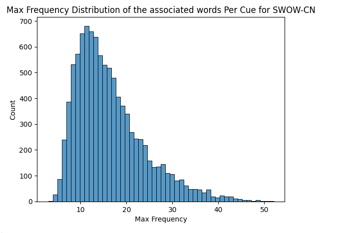
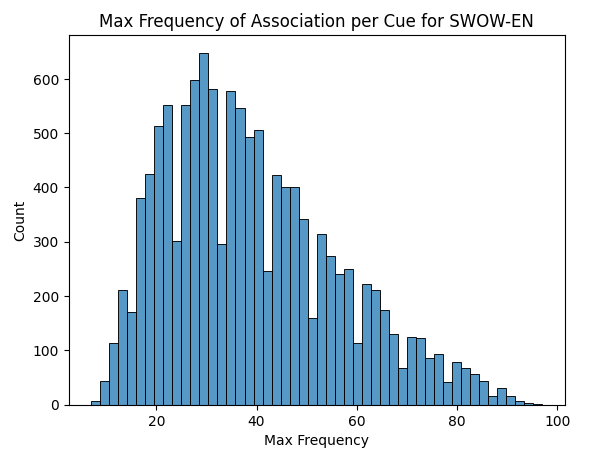

## Reward Calculation

### 1. Deprecated: Rewarding based on coverage of associated words
> Given the data we have found, where a substantial proportion of the words have a frequency count of 1, categorizing words based purely on frequency (when most words have the same frequency) appears ineffective. This kind of frequency distribution indicates that we **may not want to challenge the model to predict the frequency of the words but rather on the coverage of the associated words**.


pseudo code for reward calculation

```python
def calculate_coverage_reward(labeled_associated_word_list, predicted_word_list):
    labeled_words = set(labeled_associated_word_list)
    predicted_words = set(predicted_word_list)

    # Calculate the intersection (common words)
    common_words = labeled_words.intersection(predicted_words)

    # Calculate precision and recall for this category
    precision = len(common_words) / len(predicted_words) if predicted_words else 0
    recall = len(common_words) / len(labeled_words) if labeled_words else 0

    # Calculate F1 score (harmonic mean of precision and recall)
    if precision + recall > 0:
        f1_score = 2 * (precision * recall) / (precision + recall)
    else:
        f1_score = 0

    return f1_score
```

#### Alternatively, we can use Fuzz library to calculate 

- Check `notebooks/HLCP-11-PPO_Training/test_fuzz.ipynb` for more details

```python
from thefuzz import fuzz
en_example_1 = {"output": "ghost, scare, halloween, scary, surprise",
                "prediction": "scary, ghost, scare"}

en_example_2 = {"output": "ghost, scare, halloween, scary, surprise",
                "prediction": "scary, ghost, scare, otherthing"}


en_example_3 = {"output": "ghost, scare, halloween, scary, surprise",
                "prediction": "scary, ghost, otherthing"}

en_example_4 = {"output": "ghost, scare, halloween, scary, surprise",
                "prediction": "scary, otherthing, ghost"}
# eg1 and eg2's score should be the same 

print(fuzz.token_sort_ratio(en_example_1["prediction"], en_example_1["output"]))
print(fuzz.token_sort_ratio(en_example_2["prediction"], en_example_2["output"]))

# eg3's score should be lower than eg1 and eg2
print(fuzz.token_sort_ratio(en_example_3["prediction"], en_example_3["output"]))
# eg4's score should be lower than eg1 and eg2
print(fuzz.token_sort_ratio(en_example_4["prediction"], en_example_4["output"]))
```

### 2. Rewarding based on the frequency of associated words
I made a mistake in the previous section. The frequency of the associated words is important. And the intuition is that we shall give more rewards to the model if it predicts the words with higher frequency.





pseudo code for reward calculation

```python
# very simple, we the reward is the sum of the frequency of the words predicted by the model divided by the sum of the frequency of all the associated words of the cue word

# we need to have dict with structure {cue: {word: freq, word: freq, ...}, cue: {word: freq, word: freq, ...}, ...}

def swow_manual_reward_frequency(
    response_text_lst: list,
    cue_word_lst: list,
    associated_word_freq_dict: dict
):
    score_lst = []
    # the response text need to split using ',' or '，' if it is in Chinese
    for response_text, cue_word in zip(response_text_lst, cue_word_lst):
        response_text = response_text.split(',')
        if response_text.isascii():
            # use , to split the response text
            response_words = [x.strip() for x in response_text.split(',')]
        else:
            # use ， to split the response text
            response_words = [x.strip() for x in response_text.split('，')]

        cue_word = cue_word.strip()

        # get the sum of frequency 
        sum_freq = sum([associated_word_freq_dict[cue_word].get(word, 0) for word in response_words])
        # get the sum of frequency of all the associated words of the cue word
        sum_all_freq = sum(associated_word_freq_dict[cue_word].values())

        # calculate the reward
        score = sum_freq / sum_all_freq
        score_lst.append(score)

    return np.array(score_lst) # shape (n, )
```

## TODOs 
- [x] Currently the PPO training is not working, need to debug if it is related to the data preparation. (UPDATE: it is not related to the data preparation. Need to check the task design) 
- [ ] Need to consider another PPO task to reduce the action space of the model (e.g., MCQ, yes/no questions, etc.)
- [ ] Better reward calculation (combining the frequency of the associated words and the coverage of the associated words)
- [ ] Try vanilla Llama and Qwen models for PPO 
- [ ] PPO intermediate summary implementation
- [ ] Think about evaluation method 
- [ ] Redesign the prompt for SFT, (no base form stuff), add one more sentence: don't generate associations conditioned on the previous words but generate the associations based on the cue word.
- [x] Update Jira about this todos