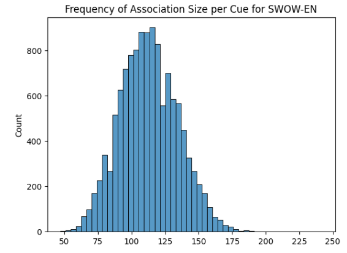
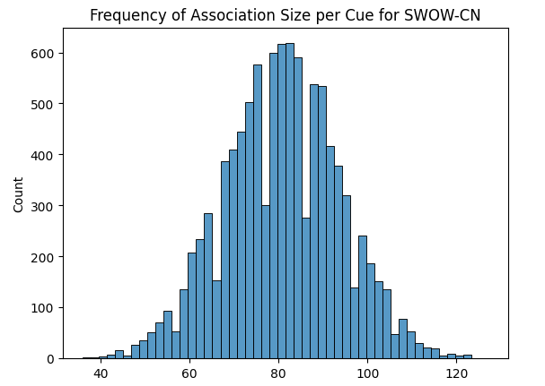

## Analyzing the Training data Stats 



```python
en_gb_cue_count.describe()
>>>
count    12271.000000
mean       112.821449
std         21.449958
min         47.000000
25%         97.000000
50%        112.000000
75%        127.000000
max        242.000000
Name: association, dtype: float64
```



```python
cn_gb_cue_count.describe()
>>>
count    10024.000000
mean        80.768156
std         12.988438
min         36.000000
25%         72.000000
50%         81.000000
75%         89.000000
max        127.000000
Name: association, dtype: float64
```

> [!TIP]
> We can see that the average association size per cue for SWOW-EN is 112.82 and for SWOW-CN is 80.77. It means that we can safely assume that we can take all the associated words into the prompt for LLM training.

### About associated word frequency value 
```python
swow_cn_df['freq'].describe()
>>>
count    809620.000000
mean          1.742006
std           2.386177
min           1.000000
25%           1.000000
50%           1.000000
75%           1.000000
max          52.000000
Name: freq, dtype: float64
```

> [!IMPORTANT]
> Given the data we have found, where a substantial proportion of the words have a frequency count of 1, categorizing words based purely on frequency (when most words have the same frequency) appears ineffective. This kind of frequency distribution indicates that we **may not want to challenge the model to predict the frequency of the words but rather on the coverage of the associated words**.

## Model Choice and Prompt Structure

EN and CN are two different languages, so we need to train two different models. We will use 
1. `meta-llama/Meta-Llama-3.1-8B-Instruct` for English
2. `Qwen/Qwen2.5-7B-Instruct` for Chinese


### Quickstart for Meta-Llama

```python
import transformers
import torch

model_id = "meta-llama/Meta-Llama-3.1-8B-Instruct"

pipeline = transformers.pipeline(
    "text-generation",
    model=model_id,
    model_kwargs={"torch_dtype": torch.bfloat16},
    device_map="auto",
)

messages = [
    {"role": "system", "content": "You are a pirate chatbot who always responds in pirate speak!"},
    {"role": "user", "content": "Who are you?"},
]

outputs = pipeline(
    messages,
    max_new_tokens=256,
)
print(outputs[0]["generated_text"][-1])
```

### Quickstart for Qwen

```python
from transformers import AutoModelForCausalLM, AutoTokenizer

model_name = "Qwen/Qwen2.5-7B-Instruct"

model = AutoModelForCausalLM.from_pretrained(
    model_name,
    torch_dtype="auto",
    device_map="auto"
)
tokenizer = AutoTokenizer.from_pretrained(model_name)

prompt = "Give me a short introduction to large language model."
messages = [
    {"role": "system", "content": "You are Qwen, created by Alibaba Cloud. You are a helpful assistant."},
    {"role": "user", "content": prompt}
]
text = tokenizer.apply_chat_template(
    messages,
    tokenize=False,
    add_generation_prompt=True
)
model_inputs = tokenizer([text], return_tensors="pt").to(model.device)

generated_ids = model.generate(
    **model_inputs,
    max_new_tokens=512
)
generated_ids = [
    output_ids[len(input_ids):] for input_ids, output_ids in zip(model_inputs.input_ids, generated_ids)
]

response = tokenizer.batch_decode(generated_ids, skip_special_tokens=True)[0]
```

## Llama Factory 

We will use https://github.com/hiyouga/LLaMA-Factory to fine-tune the models. 

Template argument for `qwen` is "qwen", and for `llama3` is "llama3".

The Github repo provides templates to generate the training data and fine-tune the models. 

### Alpaca Dataset Format

```json
  {
    "instruction": "Based on a given list of data, calculate the average a customer spends in a store",
    "input": "$12, $14, $27, $23",
    "output": "Based on the data provided, the average amount a customer spends in the store can be calculated by adding all the amounts and dividing by the number of data points. \n\n$12 + $14 + $27 + $23 = $76\n\nThere are 4 data points, so the average amount a customer spends is $76/4 = $19."
  },
  ```

We will use the Alpaca dataset format to generate the training data for the models.

To integrate the alpaca format with the LLaMA factory, please check the this [link](https://github.com/hiyouga/LLaMA-Factory/tree/main/data#alpaca-format).

Basically, the LLaMA factory require you to provide a dataset description file `dataset_info.json` 

## Prompt Structure

- We need to think about a prompt structure that can be used for both supervised fine-tuning (SFT) and Transformer Reinforcement Learning (TRL) training.

```python
en_alpaca_format = {
    "system": "You are a sophisticated language model designed to explore word associations comprehensively.",
    "instruction": "Given a cue word, your task is to generate a comprehensive list of words associated with the cue word. Aim to cover as many relevant contexts, uses, and meanings as possible without repeating similar concepts. List a target of {count_lower_bound} to {count_higher_bound} words that together provide a broad and insightful representation of all significant associations. Focus on revealing both common and unique aspects related to the cue word to ensure a balanced and thorough exploration of potential associations. Words should be distinct from each other. Your response shall only be the list of associated words. Do not generate words conditioned on the presence of other words but rather focus on the cue word itself.",
    "input": "{cue_word}",
    "output": "{association_words}"
}

zh_alpaca_format = {
    "system": "您是一款专为全面探索词语关联而设计的高级语言模型。",
    "instruction": "给定一个提示词，你的任务是生成一个与该提示词相关联的全面词汇列表。目标是尽可能涵盖所有相关的语境、用法和含义，避免重复相似的概念。列出目标数量为 {count_lower_bound} 到 {count_higher_bound} 个词，这些词共同提供对所有重要关联的广泛而深刻的表示。专注于揭示与提示词相关的常见和独特的方面，以确保对潜在关联进行平衡而彻底的探索。词语应彼此不同。你的回答只能是相关联的词语列表。不要生成受其他词语存在条件限制的词语，而是专注于提示词本身。",
    "input": "{cue_word}",
    "output": "{association_words}"
}

```

## Reward Calculation Old
pseudo code for reward calculation

```python
def eval_score(
    response_text_lst: list,
    cue_word_lst: list,
    associated_word_freq_dict: dict, # structure {"cue_word": {"associated_word": freq}}
    top_k_val: int,
):
    """
    Evaluates the score of responses based on their association with cue words.
    This function calculates a score for each response by comparing the response words
    against a dictionary of known word associations and their frequencies. The score is
    based on how well the response words match the top-k most frequent associations.
    Parameters:
    ----------
    response_text_lst : list
        List of response texts, where each text contains comma-separated words
    cue_word_lst : list
        List of cue words corresponding to each response text
    associated_word_freq_dict : dict
        Dictionary with structure {"cue_word": {"associated_word": freq}}
        Contains the frequency of association between cue words and their associated words
    top_k_val : int
        Number of top frequent associations to consider for each cue word
    Returns:
    -------
    numpy.ndarray
        Array of scores (shape: (n,)) where n is the number of responses
        Each score is the sum of frequencies of matched words divided by 
        total frequency of top-k associated words
    Notes:
    -----
    - Handles both ASCII and non-ASCII text (using ',' and '，' as delimiters respectively)
    - Removes duplicate words in responses before scoring
    - Score range is [0, 1] where higher scores indicate better matches with frequent associations
    """
    
    score_lst = []
    # the response text need to split using ',' or '，' if it is in Chinese
    for response_text, cue_word in zip(response_text_lst, cue_word_lst):
        if response_text.isascii():
            # use , to split the response text
            response_words = [x.strip() for x in response_text.split(',')]
        else:
            # use ， to split the response text
            response_words = [x.strip() for x in response_text.split('，')]
            
        # make it set to remove duplicates
        response_words = list(set(response_words))

        cue_word = cue_word.strip()
        
        # get the top k associated words from the dictionary
        # sort the associated words by frequency
        associated_words = list(associated_word_freq_dict[cue_word].keys())
        associated_words = sorted(associated_words, key=lambda x: associated_word_freq_dict[cue_word][x], reverse=True)
        associated_words = associated_words[:top_k_val]
        
        # response words and associated words replace "  " with " "
        response_words_fmted = [word.replace("  ", " ") for word in response_words if isinstance(word, str)]
        associated_words_fmted = [word.replace("  ", " ") for word in associated_words if isinstance(word, str)]
        
        # get the sum of frequency
        sum_freq= 0
        for word in response_words_fmted:
            if word in associated_words_fmted:
                word_idx = associated_words_fmted.index(word)
                sum_freq += associated_word_freq_dict[cue_word][associated_words[word_idx]]
                
        # get the sum of frequency of all the associated words of the cue word
        total_sum_freq = 0
        for word in associated_words:
            total_sum_freq += associated_word_freq_dict[cue_word][word]
            
        score = sum_freq / total_sum_freq
        score_lst.append(score)
        
    return np.array(score_lst) # shape (n, )

```

## Evaluation Result Old

| Model Type      | Dataset  | Top K | Eval Score Recall Top K|
|-----------------|----------|-------|------------|
| qwen_vanilla    | swow_en  | 10    | 0.33108    |
| qwen            | swow_en  | 10    | 0.46262    |
| llama3_vanilla  | swow_en  | 10    | 0.023099   |
| llama3          | swow_en  | 10    | 0.60653    |
| qwen_vanilla    | swow_zh  | 10    | 0.17796    |
| qwen            | swow_zh  | 10    | 0.46493    |
| llama3_vanilla  | swow_zh  | 10    | 0.052701   |
| llama3          | swow_zh  | 10    | 0.44917    |


## Reward Calculation 
pseudo code for reward calculation

```python
def eval_score_wordties(
    response_text_lst: list,
    cue_word_lst: list,
    associated_word_freq_dict: dict,  # structure {"cue_word": {"associated_word": freq}}
):
    """
    Evaluates the responses using WordTies metrics: precision@k and pooled Spearman correlation.
    
    Parameters:
    ----------
    response_text_lst : list
        List of response texts, where each text contains comma-separated words.
    cue_word_lst : list
        List of cue words corresponding to each response text.
    associated_word_freq_dict : dict
        Dictionary with structure {"cue_word": {"associated_word": freq}} containing the 
        frequency of association between cue words and their associated words.
        
    Returns:
    -------
    dict
        A dictionary containing the average precision@k for k in [5,10,20,30,40,50] and 
        the pooled Spearman correlation with p-value.
    """
    # Initialize storage for precision@k results
    precisions_at_k = {k: [] for k in [5, 10, 20, 30, 40, 50]}
    all_gold_ranks = []
    all_pred_ranks = []
    
    for response_text, cue in zip(response_text_lst, cue_word_lst):
        cue = cue.strip().lower()
        if cue not in associated_word_freq_dict:
            continue  # Skip cues not present in the gold data
        
        # Split response text into words, handling ASCII and non-ASCII delimiters
        response_text_clean = response_text.strip()
        if response_text_clean.isascii():
            response_words = [word.strip().lower() for word in response_text_clean.split(',')]
        else:
            response_words = [word.strip().lower() for word in response_text_clean.split('，')]
        
        # Deduplicate while preserving order
        seen = set()
        deduped_response_words = []
        for word in response_words:
            if word not in seen and word:
                seen.add(word)
                deduped_response_words.append(word)
        response_words = deduped_response_words
        
        # Get gold associations for the current cue
        gold_word_freq = associated_word_freq_dict.get(cue, {})
        gold_assocs = set(gold_word_freq.keys())
        
        # Calculate precision@k for each k
        for k in precisions_at_k:
            topk = response_words[:k]
            overlap = len([word for word in topk if word in gold_assocs])
            prec = overlap / k
            precisions_at_k[k].append(prec)
        
        # Prepare data for Spearman correlation
        overlapping_words = [word for word in response_words if word in gold_assocs]
        if len(overlapping_words) < 2:
            continue  # Not enough overlapping words for correlation
        
        # Sort gold words by frequency descending to determine ranks
        sorted_gold = sorted(gold_word_freq.items(), key=lambda x: (int(-x[1]), str(x[0])))
        gold_rank_dict = {word: rank + 1 for rank, (word, _) in enumerate(sorted_gold)}
        
        # Predicted ranks based on response order (1-based)
        predicted_rank_dict = {word: idx + 1 for idx, word in enumerate(response_words)}
        
        # Collect ranks for overlapping words
        gold_ranks = []
        pred_ranks = []
        for word in overlapping_words:
            gr = gold_rank_dict.get(word)
            pr = predicted_rank_dict.get(word)
            if gr is not None and pr is not None:
                gold_ranks.append(gr)
                pred_ranks.append(pr)
        
        if len(gold_ranks) >= 2:
            all_gold_ranks.extend(gold_ranks)
            all_pred_ranks.extend(pred_ranks)
    
    # Compute average precision@k
    avg_precisions = {}
    for k in precisions_at_k:
        if not precisions_at_k[k]:
            avg_prec = 0.0
        else:
            avg_prec = np.mean(precisions_at_k[k])
        avg_precisions[f'prec_at_{k}'] = round(avg_prec, 3)
    
    # Compute pooled Spearman correlation
    pooled_spearman = {'spearman': None, 'spearman_p': None}
    if len(all_gold_ranks) >= 2 and len(all_pred_ranks) >= 2:
        corr, p_value = spearmanr(all_gold_ranks, all_pred_ranks)
        pooled_spearman['spearman'] = round(corr, 3)
        pooled_spearman['spearman_p'] = round(p_value, 3)
    
    output_dict = {
        **avg_precisions,
        **pooled_spearman
    }
    
    return output_dict
    
```

## Evaluation Result 

| Model           | Dataset   | Prec@5  | Prec@10 | Prec@20 | Prec@30 | Prec@40 | Prec@50 | Spearman | Spearman_p |
|-----------------|-----------|---------|---------|---------|---------|---------|---------|----------|------------|
| llama           | swow_en   | 0.87541 | 0.77366 | 0.62477 | 0.51433 | 0.43703 | 0.3863  | 0.50362  | 0.0012122  |
| llama_vanilla   | swow_en   | 0.7548  | 0.60944 | 0.44659 | 0.35541 | 0.29534 | 0.25324 | 0.44843  | 0.03172    |
| qwen            | swow_en   | 0.76179 | 0.65171 | 0.4958  | 0.39249 | 0.32799 | 0.28119 | 0.49443  | 0.018149   |
| qwen_vanilla    | swow_en   | 0.63398 | 0.50205 | 0.36687 | 0.29031 | 0.23862 | 0.20018 | 0.37266  | 0.13532    |
| llama           | swow_zh   | 0.68973 | 0.55657 | 0.40034 | 0.32006 | 0.27775 | 0.24899 | 0.33558  | 0.11435    |
| llama_vanilla   | swow_zh   | 0.26029 | 0.18189 | 0.10881 | 0.07594 | 0.05774 | 0.04638 | 0.22356  | NaN        |
| qwen            | swow_zh   | 0.68894 | 0.5593  | 0.40327 | 0.3253  | 0.27972 | 0.25009 | 0.36576  | 0.081937   |
| qwen_vanilla    | swow_zh   | 0.48128 | 0.36401 | 0.2547  | 0.19747 | 0.15904 | 0.13237 | 0.28937  | 0.3061     |


Here are some meaningful insights:
1. Performance Gap Between Languages

    - English (swow_en) vs. Chinese (swow_zh):

        - Both models (llama and qwen) perform significantly better on English than Chinese across all metrics.

        - Example:

            - llama drops from Prec@5 = 0.875 (English) → 0.689 (Chinese)

            - qwen drops from Spearman = 0.494 (English) → 0.366 (Chinese)

    - Implication: The models may struggle with Chinese due to differences in training data quality/quantity, language complexity, or cultural context in associations.

2. Model Comparison

    - English Dataset (swow_en):

        - llama consistently outperforms qwen in precision metrics (e.g., +15% at Prec@5: 0.875 vs. 0.761).

        - llama also has a stronger Spearman correlation (0.503 vs. 0.494).

    - Chinese Dataset (swow_zh):

        - qwen slightly edges out llama in most metrics (e.g., Prec@50 = 0.250 vs. 0.248, Spearman = 0.366 vs. 0.335).

    - Takeaway: llama dominates in English, but qwen shows **marginally** better adaptability to Chinese.

3. Statistical Significance of Correlations

    - Spearman_p Values:

        - For English (swow_en): Both models show statistically significant correlations (p < 0.05).

            - llama: p = 0.0012 (very strong significance)

            - qwen: p = 0.018 (still significant but weaker)

        - For Chinese (swow_zh): Both models show weaker/no statistical significance:

            - llama: p = 0.114

            - qwen: p = 0.082

    - Implication: Results for Chinese are less reliable and may require further validation or larger datasets.

4. Precision Degradation with Larger K

   -  All models show expected precision decay as K increases (e.g., for llama on English):

        - Prec@5 → Prec@50: 0.875 → 0.386 (56% drop).

    - Notable Trend:

        - llama maintains higher precision at larger K values in English (e.g., Prec@50 = 0.386 vs. qwen's 0.281).

        - In Chinese, both models degrade similarly (~0.25 at Prec@50).